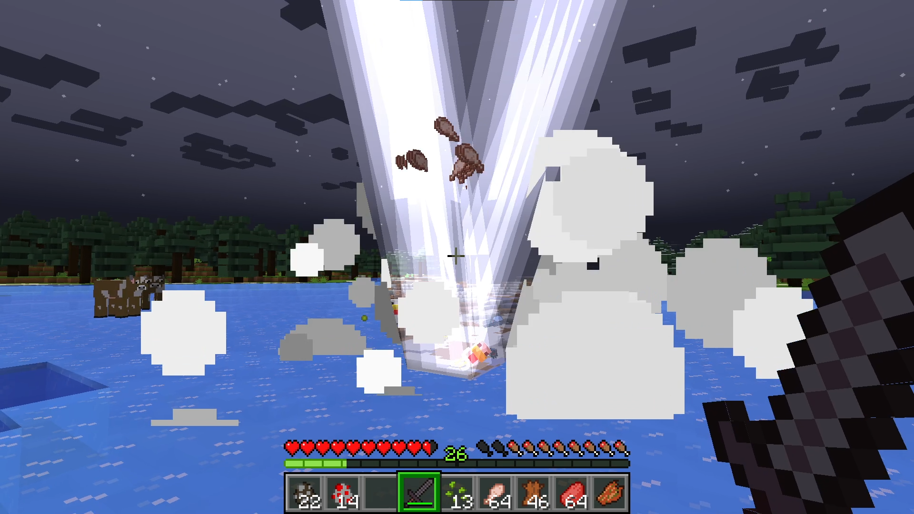

# Minecraft Explosive Animal Husbandry Plugin for Spigot

This plugin changes Minecraft's breeding mechanic. Three seconds after a baby animal is born from a player initiated breeding event, it explodes into a mist of all the items it would have dropped as an adult. Since no new baby animals can be born through breeding; drops and experience are tweaked to higher values. The parents can be bred immediately.

## Features

- Baby animals explode
- Increased drops and experience
- Parents can be bred immediately after the baby is born

## Installation

Compile the source code with maven using `mvn clean package` or download the latest release. Stop your spigot server and place the resulting jar file in the `/plugins` folder. Start your server up again and enjoy :).

## Roadmap

- [x] Meatier explosion
- [x] Lighting strike baby
- [ ] Configuration file to tweak drops, experience, lightning strikes, and displayed message